# DevX & E2E release workflow

[](https://gitpod.io/#https://github.com/judebantony/release_workflow_example)

[](https://github.com/judebantony/release_workflow_example/actions/workflows/release.yml)


# DevX - Cloud-Based IDE and GitHub Action

This sample projet is to demostrate DevX by using an integrated cloud-based IDE for feature delopment and e2e SDLC release workflow process.

#### Tools used are listed below ####

* Requirements & Planning
  * [JIRA](https://judebantony.atlassian.net)
* Devlopment
  * [VSCode](https://code.visualstudio.com/)
  * [CodeSpaces](https://codespace.io/)
  * [GitPod](https://gitpod.io/)
  * [CoPilot](https://copilot.app/)
* Language used
  * [Spring Boot](https://spring.io/projects/spring-boot)
  * [Java](https://www.java.com/en/)
* SCM
  * [GitHub](https://github.com)
* Build
  * [Mavan](https://maven.apache.org)  
* Continuous Integration
  * [Github Action](https://github.com/features/actions)
* Code Quality
  * [SonarQube](https://sonarcloud.io/organizations/judebantony/projects)
* SAST (Static Analysis Security Testing)
  * [CodeQL](https://docs.github.com/en/code-security/code-scanning/automatically-scanning-your-code-for-vulnerabilities-and-errors/about-code-scanning-with-codeql)
* SCA (Software Composition Analysis)
  * [Dependabot](https://github.blog/2020-06-01-keep-all-your-packages-up-to-date-with-dependabot/)
* Secret Scan
  * [Trufflehog](https://github.com/trufflesecurity/truffleHog)
* Maven Repository
  * [Github Package](https://github.com/trufflesecurity/truffleHog)
* Unit Testing
  * [Junit](https://junit.org/junit5/)
  * [Jacoco](https://www.baeldung.com/sonarqube-jacoco-code-coverage)
* Functional Testing
  * [Cucumber](https://cucumber.io)
  * [Selenium](https://www.selenium.dev)
  * [LamdaTest](https://www.lambdatest.com)
* Test Management
  * [Xray & Jira for Test Execution](https://docs.getxray.app/display/XRAY/About+Xray)
* Create Release Note & Tag

## IDE ##

An integrated development environment is a software application that provides comprehensive facilities to computer programmers for software development. An IDE normally consists of at least a source code editor, build automation tools and a debugger. We are using [Gitpod](https://gitpod.io/), [CodeSpaces](https://github.com/features/codespaces) & [VSCode](https://code.visualstudio.com) as an integrated development environment. We are using [CoPilot](https://github.com/features/copilot) for AI based code completion.

* [CodeSpaces](https://github.com/features/codespaces)
    * CodeSpaces is a cloud-based IDE that is backed by high performance VMs that start in seconds..
* [VSCode](https://code.visualstudio.com)
    * VSCode is a free and open-source software development platform that is built upon the Microsoft Visual Studio code editor.
* [Gitpod](https://gitpod.io/)
    * Spin up fresh, automated dev environments for each task, in the cloud, in seconds.
* [CoPilot](https://github.com/features/copilot)
    * GitHub Copilot uses the OpenAI Codex to suggest code and entire functions in real-time, right from your editor. 

CoPilot is a powerful AI-powered code completion engine that can be used to provide code completion suggestions for any language. It is a powerful tool that can be used to help you write better code, and it is a great way to learn new languages.
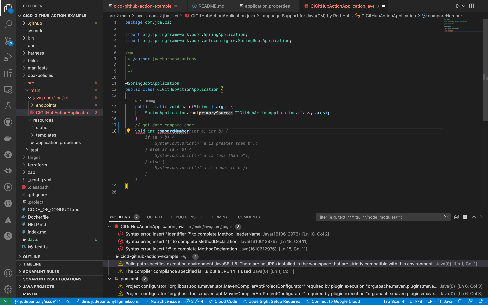

Using [Gitpod](https://gitpod.io/), we are able to spin up a fresh dev environment for each task, in the cloud and will be able to open it in browser as well.


## Plugins ##
Plugins provide productivity-boosting capabilities within your favorite Integrated Development Environments (IDEs).
VSCode plugins are available in the [marketplace](https://marketplace.visualstudio.com/vscode).
Some of the pligins used are listed below.

* [GitHub Actions](https://marketplace.visualstudio.com/items?itemName=ms-vscode.vscode-github-actions)
* [CodeSpace](https://marketplace.visualstudio.com/items?itemName=ms-vscode.vscode-codespace)
* [CoPilot](https://marketplace.visualstudio.com/items?itemName=ms-vscode.vscode-copilot)
* [GitHub](https://marketplace.visualstudio.com/items?itemName=ms-vscode.vscode-github)
* [GitHub Package](https://marketplace.visualstudio.com/items?itemName=ms-vscode.vscode-github-package)
* [Jira](https://marketplace.visualstudio.com/items?itemName=Atlassian.atlascode)
* [SonarQube](https://marketplace.visualstudio.com/items?itemName=SonarSource.sonar-vscode)
* [CodeQL](https://marketplace.visualstudio.com/items?itemName=ms-vscode.vscode-codeql)
* [Dependabot](https://marketplace.visualstudio.com/items?itemName=ms-vscode.vscode-dependabot)
* [DAST](https://marketplace.visualstudio.com/items?itemName=ms-vscode.vscode-dast)
* [OpenAPI Spec Validator](https://marketplace.visualstudio.com/items?itemName=ms-vscode.vscode-openapi-spec-validator)
* [Cucumber](https://marketplace.visualstudio.com/items?itemName=ms-vscode.vscode-cucumber)
* [LamdaTest](https://marketplace.visualstudio.com/items?itemName=ms-vscode.vscode-lambdatest)

## Linting ##

Lint, or a linter, is a static code analysis tool used to flag programming errors, bugs, stylistic errors and suspicious constructs. We are using [SonarLint](https://marketplace.visualstudio.com/items?itemName=SonarSource.sonarlint-vscode),[BlackDuckLint](https://sig-docs.synopsys.com/codesight/topics/installation_guides/vscode/c_code_sight_vscode_ig_welcome.html) as a linter. It is a code analysis tool that analyzes code for errors, smells, and other problems. It is integrated with the IDE to detect changes in the code.

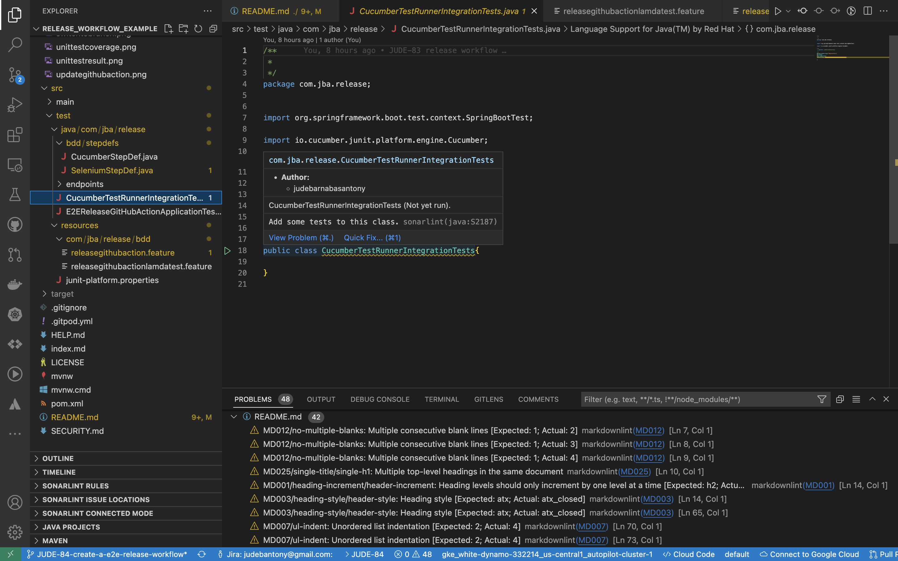


## Jira and Github Integration - (Planning,Requirement & Test Execution) ##

Jira and Github Integration will provide better traceability between Planning, Requirement, Code, Build and Test Execution.  [Linking your GitHub to Jira](https://support.atlassian.com/jira-cloud-administration/docs/integrate-with-github/) gives team the ability to see their branches, commit messages, build, test cases & results, pull requests and release information in the context of Jira tickets. More information can find [here.](https://github.blog/2018-10-04-announcing-the-new-github-and-jira-software-cloud-integration/). [VSCode](https://code.visualstudio.com) is integrated with Jira and Github using plugins, it is availbale in the [marketplace](https://marketplace.visualstudio.com/vscode).

Developer can see all the issues in the Jira in the IDE itself.


When a developer makes a commit, they should add a Jira issue key to the commit message as shown below:


Then GitHub Commit information would appear in Jira as shown below.


Once GitHub Action build is completed, build information get reflected in Jira as shown below.


Using [Cucumber](https://cucumber.io) & [Gherkin](https://cucumber.io/docs/gherkin/), we can add Test Plan & Test Cases to a specific story in Jira.

```java
Feature: Test Swagger UI
  Scenario: Swagger UI successful 

    Given user wants to check google search
    When user goes to google search using "LamdaTest"
    Then user should see google search
```


Test results will be uploaded back to Jira to provide [Requirement Traceability Matrix](https://www.tutorialspoint.com/software_testing_dictionary/requirements_traceability_matrix.htm)


## Feture Development ##
## 1. Cloning the repository ##

Clone the repository using [VSCode](https://code.visualstudio.com) [GitHub plugin](https://marketplace.visualstudio.com/items?itemName=ms-vscode.vscode-github).
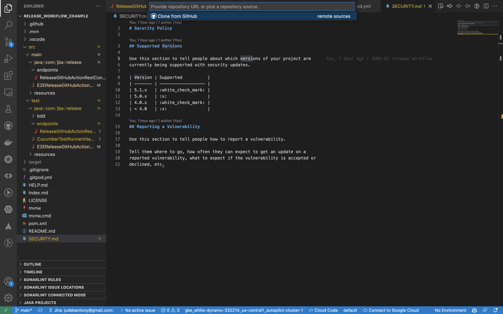


## 2. Create a Jira Tasks ##

Create Jira task and assigne to the devloper for development using [VSCode](https://code.visualstudio.com) [Jira plugin](https://marketplace.visualstudio.com/items?itemName=Atlassian.atlascode).


## 3. Start working on the task ##

* Start working on the Jira task by create feature branch using [VSCode](https://code.visualstudio.com) [Jira plugin](https://marketplace.visualstudio.com/items?itemName=Atlassian.atlascode).
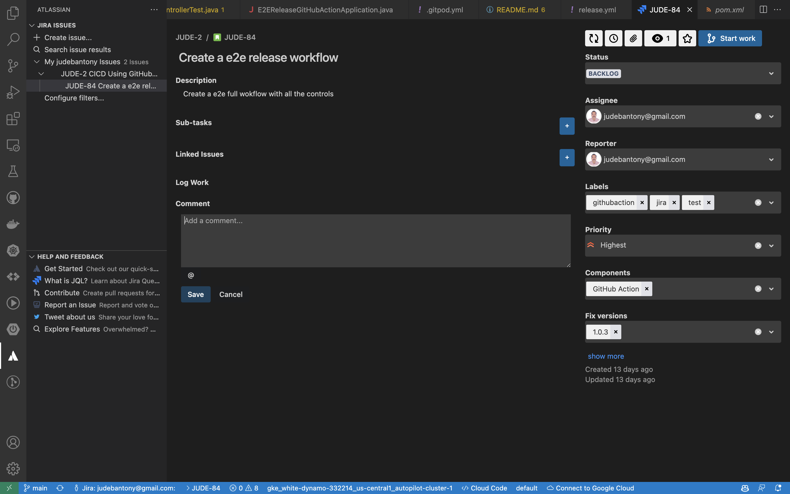


* Switch to the new branch.


* Start developing the code using [VSCode](https://code.visualstudio.com) and [CoPilot](https://github.com/features/copilot).


* Commit the changes and push to the remote repository.


* Once the code is committed, build the code using [GitHub Action](https://github.com/features/actions). Github Action log can be found in the IDE. The plugin used for this is [GitHub Action](https://marketplace.visualstudio.com/items?itemName=ms-vscode.vscode-github-action).


If you want to update any github action configuration then you can do it using [VSCode](https://code.visualstudio.com) [GitHub Action](https://marketplace.visualstudio.com/items?itemName=ms-vscode.vscode-github-action).
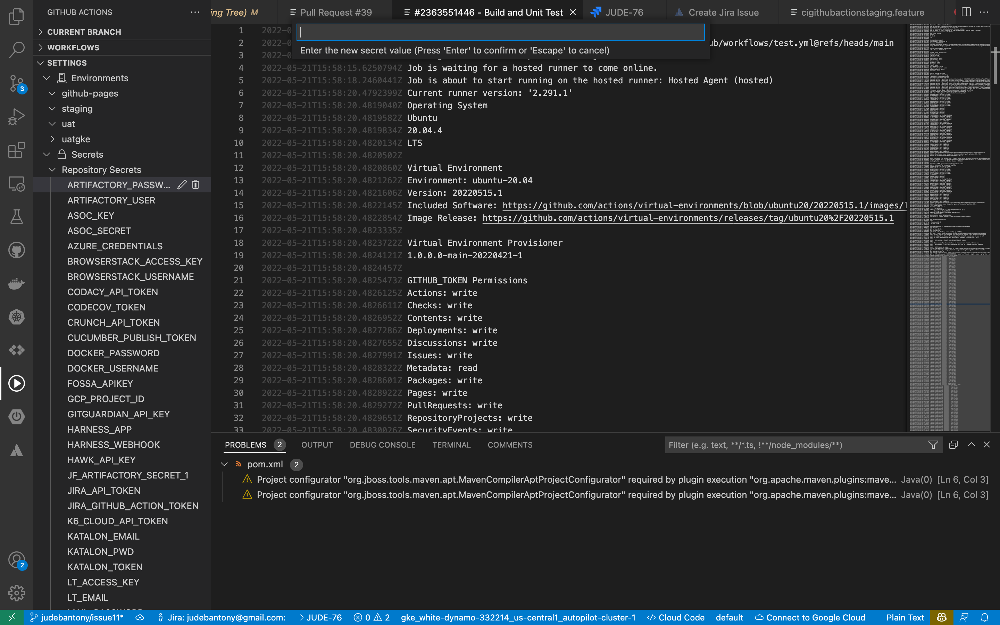

* Run the unit tests and capture the result in Jira using Xray.


Test results will be uploaded back to Jira to provide [Requirement Traceability Matrix](https://www.tutorialspoint.com/software_testing_dictionary/requirements_traceability_matrix.htm)


* Once we are done with the development of the task, we can create a pull request to the main branch. Pull request can be created using [VSCode](https://code.visualstudio.com) [GitHub plugin](https://marketplace.visualstudio.com/items?itemName=ms-vscode.vscode-github).
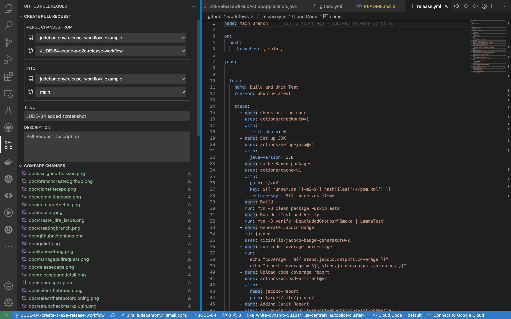


* Merge the pull request to the main branch after the peer review. Merge can be done using [VSCode](https://code.visualstudio.com) [GitHub plugin](https://marketplace.visualstudio.com/items?itemName=ms-vscode.vscode-github).

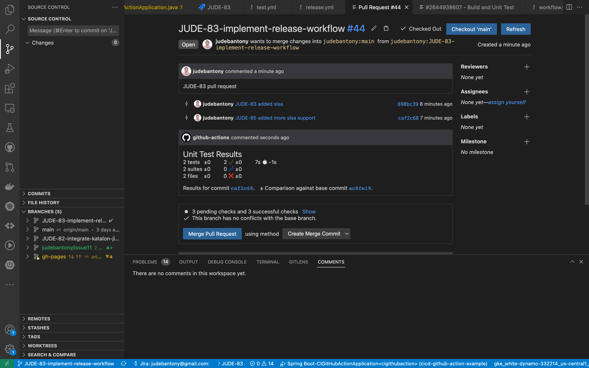


## Continuous Integration ##

Integration & Implementation of E2E CI/CD release workflow using [Github Action](https://github.com/features/actions), this has been achieved using different Cloud SaaS tools listed below.

### 1. Maven - Build and Unit Test ###

[Apache Maven](https://maven.apache.org) is a software project management and comprehension tool. Based on the concept of a project object model (POM), Maven can manage a project's build, reporting and documentation from a central piece of information.

Code is build using [Maven](https://maven.apache.org) and unit test cases are executed using [JUnit](https://junit.org/junit5/)
The test coverage result, which is aggregated by [Jacoco](https://www.baeldung.com/sonarqube-jacoco-code-coverage) would be uploaded to [Github Action](https://github.com/features/actions) as artifacts. Please check [pom.xml](https://github.com/judebantony/cicd-github-action-example/tree/main/pom.xml) as well.

```yaml

  test:
    name: Build and Unit Test
    runs-on: ubuntu-latest
    
    steps:
      - name: Check out the code
        uses: actions/checkout@v1
        with:
          fetch-depth: 0
      - name: Set up JDK
        uses: actions/setup-java@v1
        with:
          java-version: 1.8
      - name: Cache Maven packages
        uses: actions/cache@v1
        with:
          path: ~/.m2
          key: ${{ runner.os }}-m2-${{ hashFiles('**/pom.xml') }}
          restore-keys: ${{ runner.os }}-m2     
      - name: Build
        run: mvn -B clean package -DskipTests
      - name: Run UnitTest and Verify 
        run: mvn -B verify -DexcludedGroups="Smoke | Staging | BrowserStack | LamdaTest"
      - name: Generate JaCoCo Badge
        id: jacoco
        uses: cicirello/jacoco-badge-generator@v2
      - name: Log code coverage percentage
        run: |
          echo "coverage = ${{ steps.jacoco.outputs.coverage }}"
          echo "branch coverage = ${{ steps.jacoco.outputs.branches }}"
      - name: Upload code coverage report
        uses: actions/upload-artifact@v2
        with:
          name: jacoco-report
          path: target/site/jacoco/
      - name: Adding Junit Report
        uses: ashley-taylor/junit-report-annotations-action@master
        if: always()
        with:
          access-token: ${{ secrets.GITHUB_TOKEN }}          
      - name: Publish Unit Test Results
        uses: EnricoMi/publish-unit-test-result-action/composite@v1
        with:
           files: target/surefire-reports/*.xml

```

In [pom.xml](https://github.com/judebantony/release_workflow_example/tree/main/pom.xml), we need to add the jacoco plugin.

```xml
   <plugin>
    <groupId>org.jacoco</groupId>
    <artifactId>jacoco-maven-plugin</artifactId>
    <version>0.8.7</version>
    <executions>
     <execution>
      <goals>
       <goal>prepare-agent</goal>
      </goals>
     </execution>
     <execution>
      <id>generate-code-coverage-report</id>
      <phase>test</phase>
      <goals>
       <goal>report</goal>
      </goals>
     </execution>
    </executions>
   </plugin>

```

Sample test result:-
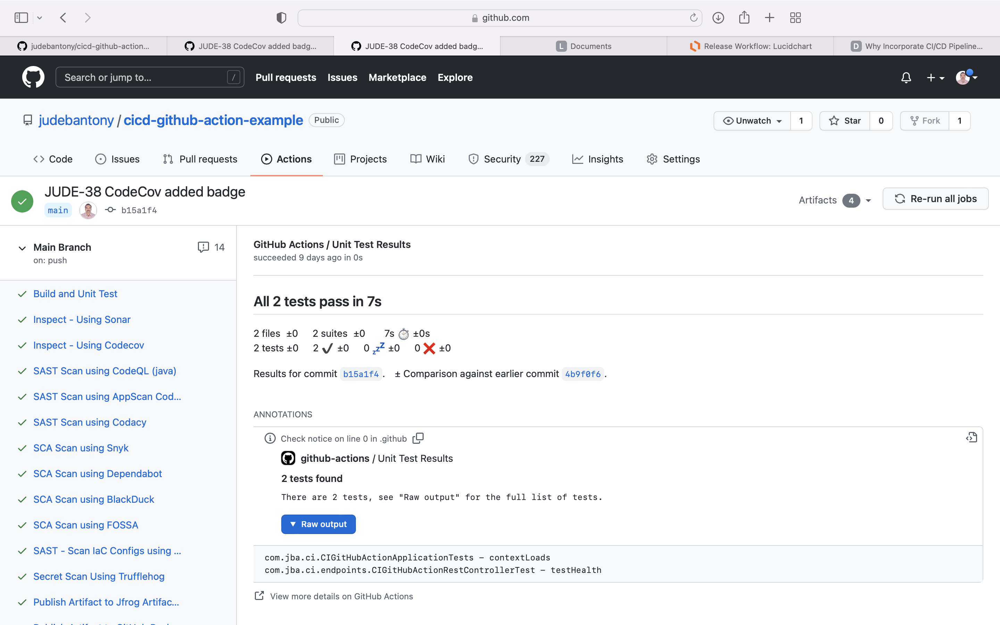

### 2. SonarQube Cloud - Code Quality ###

[SonarQube](https://www.sonarqube.org) is an open-source platform developed by SonarSource for continuous inspection of code quality to perform automatic reviews with static analysis of code to detect bugs, code smells, and security vulnerabilities on 20+ programming languages.

Inspect the code using [SonarQube](https://www.sonarqube.org) and enable the Quality Gate Check in CI/CD workflow.
Results are uploaded to [SonarQube](https://www.sonarqube.org) Cloud SaaS offering. GitHub integration with SonarQube can find [here](https://docs.sonarqube.org/latest/analysis/github-integration/).

```yaml
  sonar:
    name: Inspect - Using Sonar
    runs-on: ubuntu-latest
    needs: [test]
    
    steps:
      - name: Check out the code
        uses: actions/checkout@v1
        with:
          fetch-depth: 0
      - name: Set up JDK 11
        uses: actions/setup-java@v1
        with:
          java-version: 11
      - name: Cache SonarCloud packages
        uses: actions/cache@v1
        with:
          path: ~/.sonar/cache
          key: ${{ runner.os }}-sonar
          restore-keys: ${{ runner.os }}-sonar
      - name: Cache Maven packages
        uses: actions/cache@v1
        with:
          path: ~/.m2
          key: ${{ runner.os }}-m2-${{ hashFiles('**/pom.xml') }}
          restore-keys: ${{ runner.os }}-m2     
      - name: Build and analyze
        env:
          GITHUB_TOKEN: ${{ secrets.GITHUB_TOKEN }}
          SONAR_TOKEN: ${{ secrets.SONAR_TOKEN }}
        run: mvn -B verify -DexcludedGroups="Smoke | Staging | LamdaTest | BrowserStack" org.sonarsource.scanner.maven:sonar-maven-plugin:sonar -Dsonar.issuesReport.html.enable=true -Dsonar.projectKey=judebantony_cicd-github-action-example
      - name: SonarQube Quality Gate check
        uses: sonarsource/sonarqube-quality-gate-action@master
        env:
          GITHUB_TOKEN: ${{ secrets.GITHUB_TOKEN }}
          SONAR_TOKEN: ${{ secrets.SONAR_TOKEN }}   
        timeout-minutes: 5     
        with:
          scanMetadataReportFile: target/sonar/report-task.txt     

```

In [pom.xml](https://github.com/judebantony/release_workflow_example/tree/main/pom.xml), we need to add the below configuration.

```xml
  <sonar.organization>judebantony</sonar.organization>
  <sonar.projectKey>cicd-github-action-example</sonar.projectKey>
  <sonar.host.url>https://sonarcloud.io</sonar.host.url>

```

SonarQube dashbord:-

Quality Gate Check:-
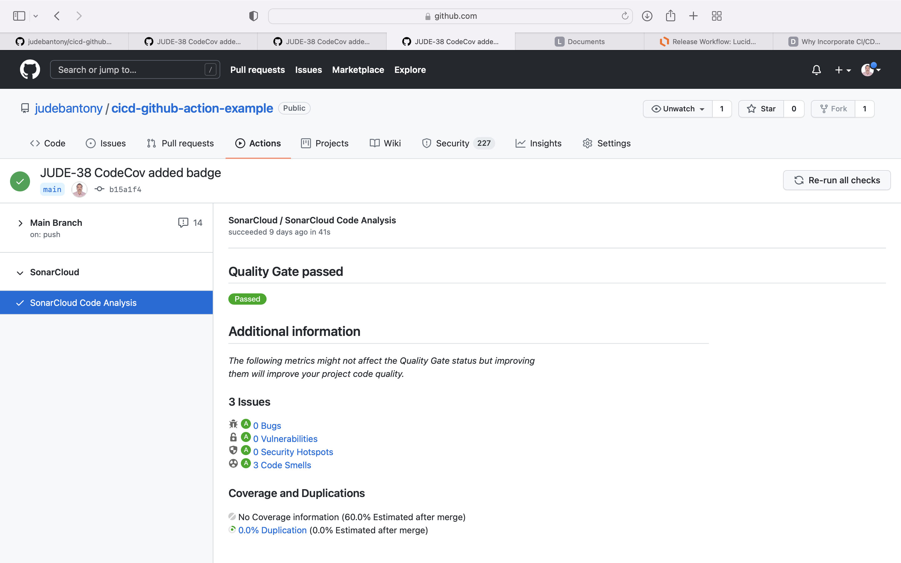

### 3. CodeQL - SAST ###

[CodeQL](https://codeql.github.com) is the code analysis engine developed by GitHub to automate security checks. You can analyze your code using CodeQL and display the results as code scanning alerts.

Use the native Github Action [CodeQL](https://codeql.github.com) for SAST scan and upload the result to [GitHub Advanced Security](https://github.com/security) tab. Configuring CodeQL code scanning can find [here](https://docs.github.com/en/code-security/code-scanning/automatically-scanning-your-code-for-vulnerabilities-and-errors/configuring-code-scanning).

```yaml
  codeqlScan:
      name: SAST Scan using CodeQL
      runs-on: ubuntu-latest
      needs: [sonar, codecov]
      
      permissions:
        actions: read
        contents: read
        security-events: write
      strategy:
        fail-fast: false
        matrix:
          language: [ 'java' ]
          
      steps:
      - name: Checkout repository
        uses: actions/checkout@v2
        with:
           fetch-depth: 0
      - name: Initialize CodeQL
        uses: github/codeql-action/init@v1
        with:
          languages: ${{ matrix.language }}
      - name: Autobuild
        uses: github/codeql-action/autobuild@v1
      - name: Perform CodeQL Analysis
        uses: github/codeql-action/analyze@v1

```

GitHub Advanced Security Tab:-
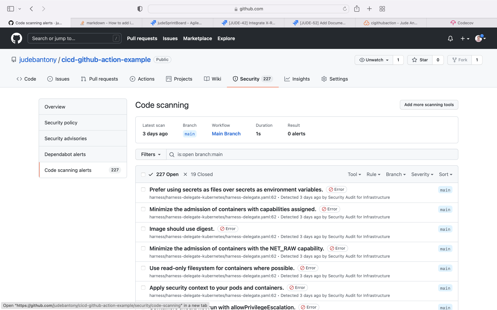

### 4. Dependabot - SCA ###

Use the github native [Dependabot](https://docs.github.com/en/code-security/supply-chain-security/managing-vulnerabilities-in-your-projects-dependencies/configuring-dependabot-security-updates) for SCA scan and upload the result to [GitHub Advanced Security](https://github.com/security) tab. Enabling the dependabot in GitHub can find [here](https://docs.github.com/en/code-security/supply-chain-security/keeping-your-dependencies-updated-automatically/enabling-and-disabling-dependabot-version-updates).

```yaml

version: 2
updates:
  - package-ecosystem: "maven"
    directory: "/" 
    schedule:
      interval: "daily"
  - package-ecosystem: "docker"
    directory: "/"
    schedule:
      interval: "weekly"

```

Dependabot dashboard:-


### 5. Trufflehog - Secret Scan ###

[Trufflehog](https://trufflesecurity.com/trufflehog) runs behind the scenes to scan your environment for secrets like private keys and credentials, so you can protect your data before a breach occurs.

Use [Trufflehog](https://trufflesecurity.com/trufflehog) to find any secrets present in the source code.

```yaml

  trufflehogScan:
      name: Secret Scan Using Trufflehog
      runs-on: ubuntu-latest
      needs: [dependabot, snykScan, blackduck, fossaScan]
      
      steps:
        - name: Check out the code
          uses: actions/checkout@v2
          with:
            fetch-depth: 0
        - name: trufflehog-actions-scan
          uses: edplato/trufflehog-actions-scan@master
          with:
            scanArguments: "--regex --entropy=False --max_depth=5" 


```
### 6. GitHub Package - Publish Artifact(jar) ###

[Github Packages](https://docs.github.com/en/packages/learn-github-packages/introduction-to-github-packages) is a software package hosting service that allows you to host your software packages privately or publicly and use packages as dependencies in your projects.

Publish the Jar to [Github Packages](https://docs.github.com/en/packages/learn-github-packages/introduction-to-github-packages).

```yaml

 gitHubPakageArtifactPush:
    name: Publish Artifact to GitHub Package
    runs-on: ubuntu-latest 
    needs: [snyIaSScan, trufflehogScan] 
    permissions: 
      contents: read
      packages: write 
      
    steps:
      - name: Check out the code
        uses: actions/checkout@v1
        with:
          fetch-depth: 0
      - name: Set up JDK 8
        uses: actions/setup-java@v1
        with:
          java-version: 1.8
      - name: Cache Maven packages
        uses: actions/cache@v1
        with:
          path: ~/.m2
          key: ${{ runner.os }}-m2-${{ hashFiles('**/pom.xml') }}
          restore-keys: ${{ runner.os }}-m2
      - name: Publish package
        run: mvn --batch-mode deploy -DskipTests
        env:
          GITHUB_TOKEN: ${{ secrets.GITHUB_TOKEN }}


```

In [pom.xml](https://github.com/judebantony/cicd-github-action-example/tree/main/pom.xml), we need to add the below configuration.

```xml
 <distributionManagement>
  <repository>
   <id>github</id>
   <name>GitHub Packages</name>
   <url>https://maven.pkg.github.com/judebantony/cicd-github-action-example</url>
  </repository>
 </distributionManagement>

```

GitHub Package UI:-
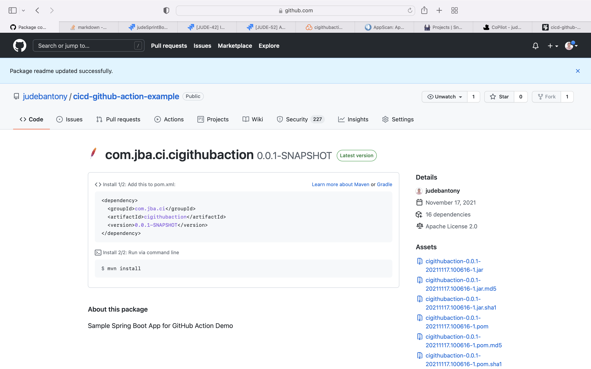

### 7. Functional Test using Xray and Jira ###

[XRay](https://www.getxray.app) is a Test Management tool integrated with Jira. Built for every member of your team to plan, test, track and release great software · Manage all your tests as Jira issues.

Xray Jira plugin is used to create the test case in [Gherkin](https://cucumber.io/docs/gherkin/) and [Cucumber](https://cucumber.io) for each Jira story and executed as part of CI/CD pipleline(GitHub Action). The result is uploaded back to Jira. XRay Test Execution config file is present [here](https://github.com/judebantony/cicd-github-action-example/tree/main/testexec_cloud_template.json).

```yaml

  jiraXrayTest:
    name: Functional Test using Xray and Jira 
    runs-on: ubuntu-latest
    needs: [uatdeploy]
        
    steps:
      - name: Check out the code
        uses: actions/checkout@v1
        with:
          fetch-depth: 0
      - name: Set up JDK
        uses: actions/setup-java@v1
        with:
          java-version: 1.8
      - name: Cache Maven packages
        uses: actions/cache@v1
        with:
          path: ~/.m2
          key: ${{ runner.os }}-m2-${{ hashFiles('**/pom.xml') }}
          restore-keys: ${{ runner.os }}-m2    
      - name: Get Xray Cloud API token
        env:
          CLIENT_ID: ${{ secrets.XRAY_CLIENT_ID }}  
          CLIENT_SECRET: ${{ secrets.XRAY_CLIENT_SECRET }}
        id: xray-token
        run: |
          echo ::set-output name=XRAY_TOKEN::$(curl -H "Content-Type: application/json" -X POST --data "{ \"client_id\": \"$CLIENT_ID\",\"client_secret\": \"$CLIENT_SECRET\" }" https://xray.cloud.xpand-it.com/api/v1/authenticate| tr -d '"')
      - name: Get Features from XRAY 
        shell: bash
        run: |
           curl -H "Content-Type: application/json" --output ./features.zip -X GET -H "Authorization: Bearer ${{ steps.xray-token.outputs.XRAY_TOKEN }}"  "https://xray.cloud.xpand-it.com/api/v1/export/cucumber?keys=JUDE-43"
           unzip -o features.zip -d ./src/test/resources/com/jba/ci/bdd/   
      - name: Build
        run: mvn -B clean package -DskipTests
      - name: Run UnitTest and Verify 
        run: mvn -B verify -DexcludedGroups="Smoke | Staging | BrowserStack | LamdaTest"
      - name: Generate JaCoCo Badge
        id: jacoco
        uses: cicirello/jacoco-badge-generator@v2
      - name: Log code coverage percentage
        run: |
          echo "coverage = ${{ steps.jacoco.outputs.coverage }}"
          echo "branch coverage = ${{ steps.jacoco.outputs.branches }}"
      - name: Upload to XRAY 
        shell: bash
        run: |
           curl  -X POST -H "Authorization: Bearer ${{ steps.xray-token.outputs.XRAY_TOKEN }}" -F info=@testexec_cloud_template.json -F results=@"target/cucumber-reports/cucumber.json" "https://xray.cloud.xpand-it.com/api/v1/import/execution/cucumber/multipart"          

```

Jira Xray test execution dashboard:-
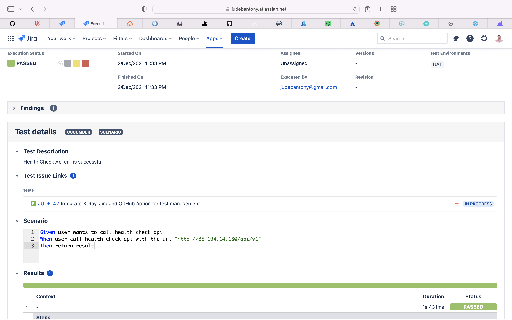
### 8. Release Tag Creation ###

Create a release tag for the branch.

```yaml

  releaseTag:
      name: Release Tag & Note Creation 
      runs-on: ubuntu-latest
      needs: [k6_cloud_test]
      steps:
        - name: Checkout
          uses: actions/checkout@v2
          with:
            fetch-depth: 0
        - name: Bump version and push tag
          id: tag_version
          uses: anothrNick/github-tag-action@1.26.0
          env:
            GITHUB_TOKEN: ${{ secrets.GITHUB_TOKEN }}
            WITH_V: true
      
        - name: Build Changelog
          id: github_release
          uses: mikepenz/release-changelog-builder-action@v1
          env:
            GITHUB_TOKEN: ${{ secrets.GITHUB_TOKEN }}
  
        - name: Create Release
          uses: actions/create-release@v1
          with:
            tag_name: ${{ steps.tag_version.outputs.new_tag }}
            release_name: Release ${{ steps.tag_version.outputs.new_tag }}
            body: ${{steps.github_release.outputs.changelog}}
          env:
            GITHUB_TOKEN: ${{ secrets.GITHUB_TOKEN }}  

```

Release Tag:-


## Release ##


## Author

* **Jude Antony**
[ LinkedIn](https://www.linkedin.com/in/jude-antony-2b208219/)
&nbsp;
[ GitHub](https://github.com/judebantony)

## License

This project is licensed under the Apache License - see the [LICENSE](LICENSE) file for details
